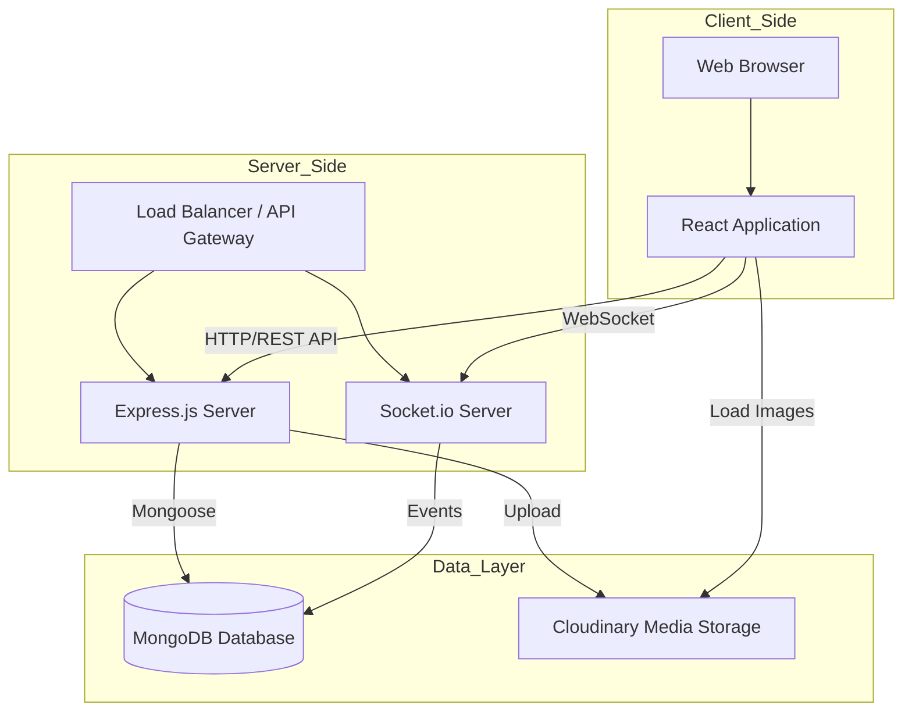
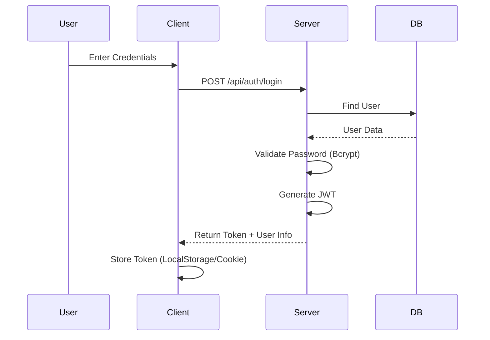
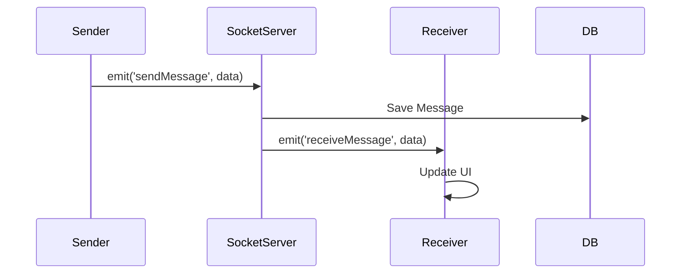
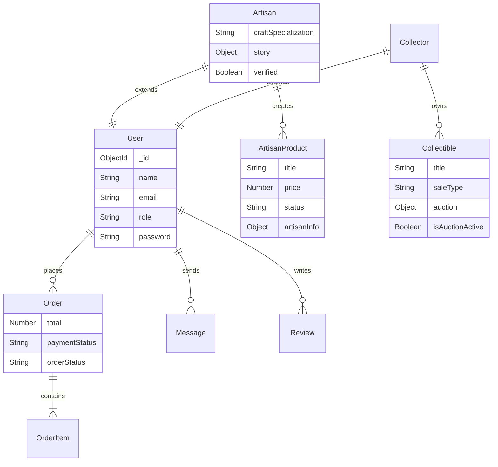

# CraftCurio Project Report

**Project Title:** CraftCurio: Artisan & Collectibles Marketplace  
**Prepared by:** [Your Name]  
**Institution:** [Your College/University]  
**Date:** November 2025

---

## Abstract

CraftCurio is a specialized digital marketplace designed to bridge the gap between traditional artisans, antique collectors, and discerning buyers. Unlike generic e-commerce platforms, CraftCurio focuses on the narrative behind every object, offering a hybrid sales model that supports both direct purchases of artisan goods and auction-based sales for rare collectibles. The system integrates real-time bidding, multimedia artisan stories, and a robust role-based administration system to create a trustworthy and engaging ecosystem for preserving cultural heritage and promoting craftsmanship.

---

## 1. Introduction

### 1.1 Problem Statement
Traditional artisans often struggle to reach a global audience, and their unique stories are frequently lost in mass-market platforms. Similarly, collectors of rare items lack a dedicated, secure platform that validates authenticity and supports dynamic pricing mechanisms like auctions. Existing solutions are either too broad (e.g., Amazon) or lack the specific features needed for high-value, story-driven commerce.

### 1.2 Objectives
*   To provide a dedicated platform for artisans to showcase their crafts and tell their stories.
*   To enable collectors to buy and sell rare items through a secure auction system.
*   To implement a real-time bidding engine using Socket.io.
*   To ensure secure user authentication and role-based access control.
*   To foster a community through direct messaging and artisan engagement.

### 1.3 Scope
The project covers the development of a responsive web application with a React frontend and Node.js backend. It includes modules for user management, product listing, auctions, shopping cart/checkout, and content management.

### 1.4 Target Users
*   **Buyers:** Individuals looking for unique, handmade, or vintage items.
*   **Artisans:** Creators selling handmade goods and sharing their craft's history.
*   **Collectors:** Users buying/selling rare collectibles, often via auction.
*   **Admins:** Platform managers overseeing users, content, and transactions.

---

## 2. Literature Survey / Existing System

| Feature | Etsy | eBay | CraftCurio |
| :--- | :--- | :--- | :--- |
| **Primary Focus** | Handmade/Vintage | General Auctions | Artisan Stories & Collectibles |
| **Sales Model** | Direct Sale | Auction & Direct | Hybrid (Direct + Auction) |
| **Storytelling** | Basic Profile | Minimal | Rich Multimedia (Video/Audio) |
| **Real-time** | Notifications | Bidding | Bidding & Chat |
| **Target Audience** | Mass Market | Mass Market | Niche/Curated |

**Gap Analysis:** While Etsy excels at handmade goods, it lacks the auction dynamics for collectibles. eBay has auctions but lacks the narrative depth for artisans. CraftCurio merges these to serve a specific niche of "storied objects."

---

## 3. Proposed System

CraftCurio introduces a **Hybrid Marketplace** model:
1.  **Artisan Marketplace:** Direct sales of handmade goods with a focus on "Artisan Stories"—dedicated pages with photos, videos, and cultural context.
2.  **Collectibles Auction House:** A real-time auction system for rare items, featuring live bidding updates, countdowns, and reserve prices.
3.  **Unified Experience:** A single user account can act as a buyer, while specialized roles (Artisan, Collector) unlock selling features.
4.  **Admin CMS:** A comprehensive dashboard for verifying artisans, approving products, and managing platform content.

---

## 4. System Requirements

### 4.1 Hardware Requirements
*   **Client:** Any modern device with a web browser (Laptop, Tablet, Smartphone).
*   **Server:** Cloud-based instance (e.g., AWS EC2, Heroku, or Vercel/Render) with at least 1GB RAM.

### 4.2 Software Stack
*   **Frontend:** React (Vite), Tailwind CSS, Radix UI.
*   **Backend:** Node.js, Express.js.
*   **Database:** MongoDB (Mongoose ODM).
*   **Real-time:** Socket.io.
*   **Storage:** Cloudinary (for images/media).
*   **Authentication:** JWT (JSON Web Tokens).

---

## 5. System Architecture

The system follows a **MERN (MongoDB, Express, React, Node.js)** architecture with a decoupled client-server model.



**Layer Description:**
*   **Presentation Layer (React):** Handles UI rendering, state management (Context API), and user interactions.
*   **Application Layer (Node/Express):** Processes API requests, executes business logic, and manages authentication.
*   **Real-time Layer (Socket.io):** Handles bi-directional communication for chat and auction bids.
*   **Data Layer (MongoDB):** Stores structured data (users, products, orders).
*   **Media Layer (Cloudinary):** Stores and optimizes user-uploaded images.

---

## 6. Module Design

### 6.1 User Authentication & Roles
Handles registration, login (Password/OTP), and role management.



### 6.2 Messaging & Chat
Real-time communication between buyers and sellers.



### 6.3 Artisan Products & Stories
Allows artisans to list products and tell their story.
*   **Flow:** Artisan uploads media -> Server saves to Cloudinary -> Server creates Product/Story record -> Admin approves -> Live on site.

### 6.4 Collector Dashboard & Auctions
Manages collectible listings and the bidding engine.

```mermaid
flowchart LR
    A[Collector Lists Item] --> B{Sale Type?}
    B -- Direct Sale --> C[Listed at Fixed Price]
    B -- Auction --> D[Set Start/End Time & Reserve]
    D --> E[Auction Scheduled]
    E --> F[Auction Live]
    F --> G{Bids Received?}
    G -- Yes --> H[Update Current Bid (Socket.io)]
    G -- No --> F
    F --> I[Time Expired]
    I --> J{Reserve Met?}
    J -- Yes --> K[Sold to Highest Bidder]
    J -- No --> L[Auction Ended (Unsold)]
```

### 6.5 Admin Dashboard
Central control for:
*   User Management (Ban/Unban).
*   Product Approval (Pending -> Approved).
*   Content Management (About Us, FAQs).

---

## 7. Database Design

The database uses a document-oriented model (MongoDB). Key schemas include:



---

## 8. Detailed Design & Implementation

### 8.1 Frontend Structure
*   **`src/pages`**: Contains route components (e.g., `Landing.jsx`, `ProductDetails.jsx`, `CollectorDashboardPage.jsx`).
*   **`src/components`**: Reusable UI blocks (e.g., `Navbar`, `ProductCard`, `AuctionTimer`).
*   **`src/contexts`**: Global state providers (`AuthContext`, `CartContext`, `WishlistContext`).
*   **`src/hooks`**: Custom logic (e.g., `useSocket`, `useDebounce`).

### 8.2 Backend Structure
*   **`src/api/routes`**: Express routers defining API endpoints.
*   **`src/controllers`**: Business logic functions (e.g., `createCollectible`, `placeBid`).
*   **`src/models`**: Mongoose schemas defining data structure and validation.
*   **`src/middleware`**: `authMiddleware` (JWT verify), `uploadMiddleware` (Multer).

### 8.3 Important Flows
*   **Auction Bidding:**
    1.  User places bid via UI.
    2.  API validates bid > current bid + increment.
    3.  Database updates `auction.currentBid` and pushes to `auction.bidHistory`.
    4.  Socket.io emits `bidUpdate` event to all clients viewing the item.
    5.  Clients update price in real-time without refresh.

---

## 9. User Interface & UX

*   **Design Philosophy:** Clean, modern aesthetic using Tailwind CSS. Focus on high-quality imagery to showcase crafts.
*   **Responsiveness:** Mobile-first approach ensuring usability on phones and tablets.
*   **Key Pages:**
    *   **Landing Page:** Hero section, featured artisans, trending collectibles.
    *   **Artisan Story:** Immersive layout with bio, video, and gallery.
    *   **Auction Room:** Live countdown timer, bid history list, "Place Bid" controls.

---

## 10. Testing

*   **Unit Testing:** Jest is configured for backend logic testing.
*   **API Testing:** Postman/Insomnia used to verify endpoints (Auth, Products, Orders).
*   **Manual Testing:**
    *   **Functional:** Verifying signup, checkout, and bidding flows.
    *   **UI/UX:** Checking responsiveness and cross-browser compatibility.
    *   **Edge Cases:** Testing auction expiration, out-of-stock items, and invalid inputs.

---

## 11. Security & Performance

### 11.1 Security
*   **Authentication:** JWT for stateless, secure session management.
*   **Password Hashing:** Bcrypt used to hash passwords before storage.
*   **Input Validation:** Zod schemas validate all incoming API data to prevent injection.
*   **Headers:** Helmet.js sets secure HTTP headers.
*   **Rate Limiting:** `express-rate-limit` prevents brute-force attacks on auth endpoints.

### 11.2 Performance
*   **Indexing:** MongoDB fields (e.g., `category`, `status`, `tags`) are indexed for fast retrieval.
*   **Pagination:** APIs implement pagination to limit data payload size.
*   **CDN:** Cloudinary serves optimized images via CDN.
*   **Debouncing:** Search inputs are debounced to reduce API calls.

---

## 12. Results & Discussion

The project successfully implements a functional marketplace with:
*   Dual-role system (users can be buyers and sellers).
*   Live auction capability with real-time updates.
*   Secure payment processing simulation (Order/Cart flow).
*   Rich content management for artisan storytelling.

Unique aspects include the **Artisan Story** module, which humanizes the shopping experience, and the **Hybrid Sales Model**, catering to different types of sellers.

---

## 13. Conclusion & Future Scope

### 13.1 Conclusion
CraftCurio addresses the need for a specialized platform that values the history and craftsmanship behind objects. By combining modern e-commerce features with storytelling and auctions, it creates a unique value proposition for its target audience.

### 13.2 Future Scope
*   **Mobile Application:** Native iOS/Android apps using React Native.
*   **AI Recommendations:** Personalized product suggestions based on browsing history.
*   **Payment Gateway:** Integration with Stripe/Razorpay for real payments.
*   **Blockchain:** NFT certificates of authenticity for high-value collectibles.

---

## 14. References

*   React Documentation: https://react.dev/
*   Node.js Documentation: https://nodejs.org/en/docs/
*   MongoDB Manual: https://www.mongodb.com/docs/manual/
*   Socket.io Documentation: https://socket.io/docs/v4/
*   Tailwind CSS: https://tailwindcss.com/
