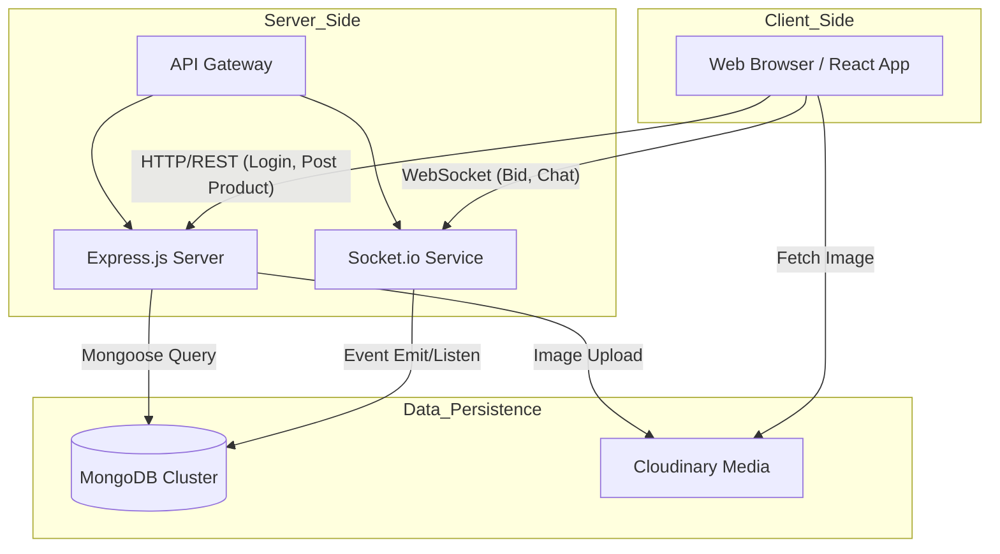
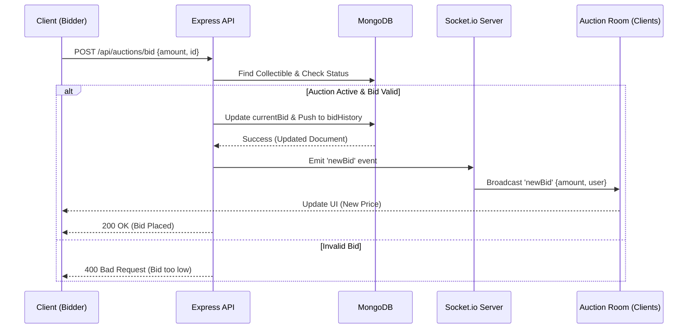
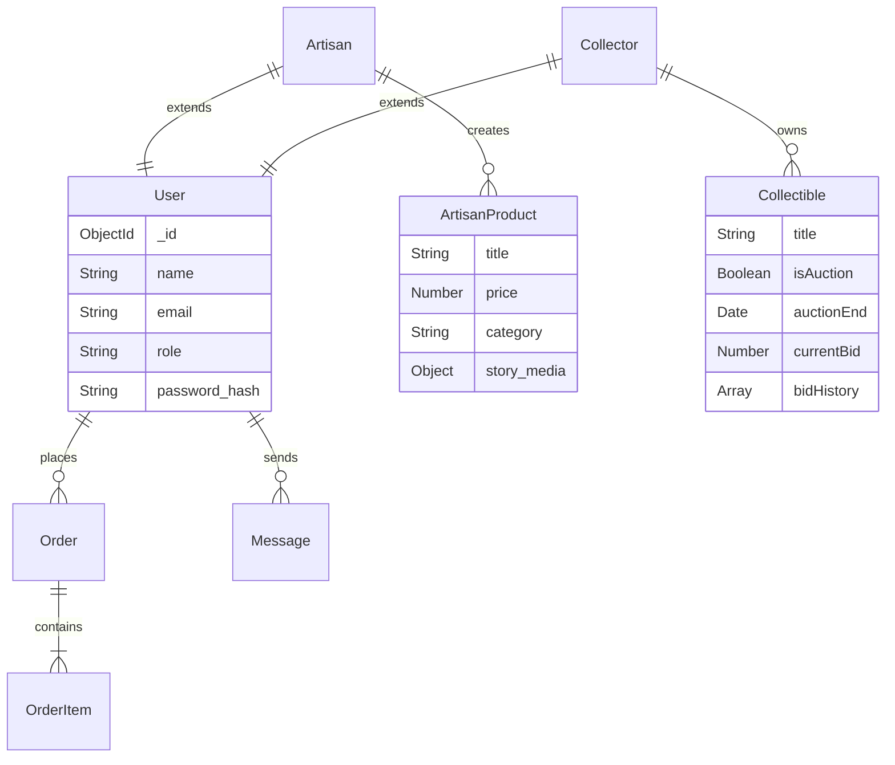

# CraftCurio: A Full-Stack Marketplace Platform Empowering Local Artisans and Collectors with Real-Time Features

**Abstract**

In an era dominated by mass-produced goods, traditional artisans often struggle to find sustainable markets for their unique, handcrafted items. While generic e-commerce platforms exist, they frequently fail to capture the narrative depth required to sell high-value cultural artifacts or support the dynamic pricing mechanisms needed for rare collectibles. This paper presents **CraftCurio**, a specialized full-stack web application designed to bridge this gap. Built using the MERN stack (MongoDB, Express.js, React, Node.js), CraftCurio introduces a hybrid marketplace model that integrates direct sales for artisans with a real-time auction house for collectors. Key technical innovations include a Socket.io-based bidding engine that ensures sub-second latency for auction updates and a role-based dashboard system that offers distinct workflows for buyers, sellers, and administrators. The platform also emphasizes "story-driven commerce" by allowing artisans to embed multimedia narratives alongside their products. Our results demonstrate that this feature-rich environment not only enhances user engagement but also provides a secure, transparent ecosystem for preserving cultural heritage.

**Keywords:** Artisan marketplace, full-stack web development, real-time bidding, Socket.io, MongoDB, React dashboard.

---

## I. Introduction

### A. Background and Motivation
The preservation of traditional craftsmanship is a significant challenge in the modern digital economy. For many artisans, particularly in regions like India with rich cultural histories, the difficulty lies not in the quality of their work but in their limited access to global markets. According to recent market reports, the global handicraft market reached a value of US$ 718 Billion in 2020, yet a significant portion of this revenue does not reach the primary creators due to intermediaries and lack of direct market access. Traditional brick-and-mortar sales are geographically constrained, and while major e-commerce giants offer reach, they often commoditize unique goods, stripping them of the stories that give them value.

This project, **CraftCurio**, was born out of a desire to create a digital ecosystem that respects and elevates the artisan. Developed as a comprehensive B.Tech final year project, it evolved from a simple listing site into a complex, real-time marketplace. Our primary motivation was to engineer a solution that serves two distinct but overlapping communities: artisans who need a platform to tell their stories, and collectors who seek a secure environment to trade rare items.

### B. Problem Statement
Existing platforms fail to address the specific needs of the "storied object" economy.
1.  **Loss of Narrative:** Generic platforms like Amazon treat a hand-carved statue the same as a factory-made toy. There is no dedicated space for video narratives or artisan biographies.
2.  **Static Pricing Models:** Rare collectibles often have no fixed market price. Fixed-price listings undervalue these items, whereas auction mechanisms are better suited for price discovery.
3.  **Technical Latency:** Many regional auction sites suffer from high latency, leading to "bid sniping" failures and user frustration.

### C. Objectives
The primary objective is to design and develop a full-stack web application that solves these problems. Specific technical goals include:
*   **Sub-second Latency:** Implementing a bidding engine with <200ms latency using WebSockets.
*   **Scalable Architecture:** Designing a decoupled MERN stack architecture capable of handling concurrent auction rooms.
*   **Secure Authentication:** Implementing dual-factor authentication (Password + OTP) and Role-Based Access Control (RBAC).

### D. Scope
The scope of this project covers the full software development lifecycle, from requirement analysis to the deployment of a responsive web application. It includes:
*   **User Modules:** Buyer, Artisan, Collector, and Admin dashboards.
*   **Core Features:** Product listing, Real-time Bidding, Live Chat, and Order Management.
*   **Limitations:** The current version is a web-only application; a native mobile app is proposed for future work. Payment processing is currently simulated for demonstration purposes.

The remainder of this paper is organized as follows: Section II reviews existing literature and platforms. Section III details the system architecture. Section IV describes the core implementation and code logic. Section V presents our results and performance evaluation, and Section VI concludes with future enhancement possibilities.

## II. Literature Review

The digital marketplace landscape is crowded, yet specific niches remain underserved. We analyzed several existing platforms and theoretical frameworks to identify gaps that CraftCurio could fill.

### A. Theoretical Framework
To design an effective real-time marketplace, we examined two key areas:
1.  **Real-Time Web Systems:** Traditional HTTP requests follow a request-response cycle, which is inefficient for live updates. Techniques like **Short Polling** (client requests every n seconds) waste bandwidth. **Long Polling** keeps connections open but is resource-intensive. **WebSockets** (RFC 6455) provide a full-duplex communication channel over a single TCP connection, making them the ideal choice for our auction engine where millisecond-level updates are critical.
2.  **Auction Theory:** We implemented an **English Auction** (Open Ascending Price) model. This is the most transparent type for online environments, where the identity of bidders is hidden but the current highest bid is visible. This model encourages competition and maximizes the final sale price for the seller.

### B. Comparative Analysis of Existing Platforms

| Feature | Etsy | Amazon Handmade | eBay | CraftCurio |
| :--- | :--- | :--- | :--- | :--- |
| **Primary Focus** | Handmade/Vintage | Handmade (Mass Market) | General Auctions | Artisan Stories & Collectibles |
| **Sales Model** | Direct Sale | Direct Sale | Auction & Direct | Hybrid (Direct + Auction) |
| **Storytelling** | Basic Profile | Minimal | Minimal | **Rich Multimedia (Video/Audio)** |
| **Real-time** | Notifications | None | Bidding | **Bidding & Live Chat** |
| **Fees** | High Listing Fees | High Commission (15%) | Variable | Low/Community Focused |

**Etsy** is the market leader for handmade goods but operates primarily on a fixed-price model. It lacks the dynamic pricing needed for rare collectibles. **Amazon Handmade** offers vast reach but imposes high fees and strict standardization that stifles the artisan's unique brand identity. **eBay** supports auctions but is a generalist platform where "handcrafted" items are often lost in a sea of mass-produced goods.

### C. Gap Analysis
From a technical perspective, many existing local artisan initiatives in India rely on static websites or basic CMS platforms (like WordPress) which lack real-time interactivity. They often suffer from stale inventory data and lack engaging features like live bidding or instant buyer-seller communication. CraftCurio addresses these gaps by combining the storytelling focus of a niche artisan site with the dynamic technical infrastructure of a modern auction house. We surveyed technologies like **Node.js** for its non-blocking I/O, which is ideal for handling concurrent auction bids, and **Socket.io** for enabling the real-time features that modern users expect.

## III. System Architecture

The architecture of CraftCurio is built on the **MERN stack**, chosen for its unified JavaScript development environment and robust community support. The system is designed as a decoupled client-server application, ensuring scalability and maintainability.

### A. Technology Stack

1.  **Frontend:** The user interface is built with **React.js**, utilizing **Vite** for rapid build times. We employed **Tailwind CSS** for a utility-first styling approach, allowing us to create a bespoke, responsive design without fighting against framework defaults. **Radix UI** primitives were used for accessible interactive components like modals and dropdowns.
2.  **Backend:** The server-side logic runs on **Node.js** with **Express.js**. This provides a lightweight, event-driven architecture suitable for handling I/O-heavy operations like database queries and image uploads.
3.  **Database:** **MongoDB** serves as our primary data store. Its document-oriented nature allows for flexible schema design, which is essential when dealing with diverse product types (standard artisan goods vs. unique auction collectibles). We use **Mongoose** for object data modeling.
4.  **Real-Time Layer:** **Socket.io** is integrated to enable bi-directional communication. This is the backbone of our auction bidding system and live chat features, pushing updates to clients instantly without the need for polling.
5.  **Media Storage:** **Cloudinary** is used for cloud-based image management, ensuring that high-resolution artisan photos are optimized and served quickly via CDN.

### B. Data Flow Architecture

The following diagram illustrates how data moves through the system, particularly highlighting the dual communication channels: standard HTTP REST API requests for CRUD operations and WebSocket connections for real-time events.



### C. Sequence Diagram: Real-Time Bidding Flow

To further illustrate the real-time capabilities, the following sequence diagram details the flow of a "Place Bid" event. This highlights the interaction between the Client, REST API, Database, and Socket Server.



### D. Database Design Decisions
A critical part of our architecture is the database schema. We chose **MongoDB** for its schema flexibility, which is essential when dealing with diverse product types.

1.  **Schema Inheritance vs. Composition:** We used a composition pattern for Users. Instead of a single monolithic User schema, we have a base User schema extended by specific profile schemas (ArtisanProfile, CollectorProfile) linked via ObjectId. This keeps the auth logic clean while allowing rich, role-specific data.
2.  **Normalization Strategy:**
    *   **Users & Orders:** Highly normalized to prevent data redundancy.
    *   **Auctions:** We chose a **denormalized** approach for the `Collectible` schema. The `currentBid` and `bidHistory` are stored directly within the Collectible document. While this increases document size, it drastically reduces read latency during high-traffic auctions, as we avoid expensive JOIN operations (or `$lookup` in MongoDB) every time the price updates.

The Entity-Relationship (ER) diagram below visualizes these relationships:




## IV. Implementation

The implementation phase focused on translating the architectural design into a functional system. Key challenges included managing state in a real-time environment and ensuring secure role-based access.

### A. Security and Authentication
Security is paramount in a transactional platform. We implemented a robust authentication system using **JSON Web Tokens (JWT)**.
1.  **Password Hashing:** User passwords are never stored in plain text. We use `bcryptjs` with a salt round of 10 to hash passwords before saving them to MongoDB.
2.  **Middleware Protection:** All protected routes (e.g., placing a bid, uploading a product) are guarded by a custom middleware `protect`. This middleware extracts the Bearer token from the header, verifies the signature, and attaches the user object to the request.

```javascript
// backend/src/middleware/authMiddleware.js
const protect = asyncHandler(async (req, res, next) => {
  let token;
  if (req.headers.authorization?.startsWith('Bearer')) {
    try {
      token = req.headers.authorization.split(' ')[1];
      const decoded = jwt.verify(token, process.env.JWT_SECRET);
      req.user = await User.findById(decoded.id).select('-password');
      next();
    } catch (error) {
      res.status(401).json({ message: 'Not authorized, token failed' });
    }
  }
});
```

### B. Real-Time Auction Engine
The core innovation of CraftCurio is its live auction capability. We implemented a "Room-based" architecture using Socket.io.

**1. Room Management:**
When a user visits an auction page, the client establishes a connection and joins the specific room. This ensures that bid updates are broadcast only to relevant users, minimizing bandwidth usage.

```javascript
// backend/src/sockets/auctionSocket.js
socket.on('joinAuction', async (data) => {
  const { collectibleId } = data;
  socket.join(`auction-${collectibleId}`); // Join specific room
  
  // Send initial state immediately
  const collectible = await Collectible.findById(collectibleId).lean();
  socket.emit('auctionData', {
    currentBid: collectible.auction.currentBid,
    timeRemaining: Math.max(0, new Date(collectible.auction.endTime) - new Date())
  });
});
```

**2. Handling Race Conditions:**
One significant challenge was handling the "race condition" where two users bid simultaneously. If User A and User B both see the price at $100 and bid $110 at the same time, a naive implementation might accept both. We resolved this by using MongoDB's atomic operators. The update query includes a condition that the new bid must be greater than the *stored* current bid.

```javascript
// backend/src/controllers/auctionController.js
const placeBid = async (req, res) => {
  const { amount } = req.body;
  // Atomic update: Only update if new amount > currentBid
  const updatedCollectible = await Collectible.findOneAndUpdate(
    { 
      _id: req.params.id, 
      'auction.currentBid': { $lt: amount } // CRITICAL: Concurrency check
    },
    { 
      $set: { 'auction.currentBid': amount },
      $push: { 'auction.bidHistory': { user: req.user._id, amount } }
    },
    { new: true }
  );
  
  if (!updatedCollectible) {
    return res.status(400).json({ message: 'Bid too low or auction updated' });
  }
  
  // Broadcast success to room
  emitNewBid(updatedCollectible._id, { amount, user: req.user.name });
};
```

### C. Frontend State Management
We implemented a strict separation of concerns using **React Context API**.
*   **AuthContext:** Manages user session and token persistence.
*   **SocketContext:** Wraps the application to provide a singleton socket instance. This prevents multiple socket connections from opening when components re-render.
*   **Optimistic UI:** For features like "Like" or "Wishlist", we update the UI immediately before the API call completes to make the app feel snappier. However, for Bidding, we intentionally *disable* optimistic updates. The UI only updates when the server confirms the bid via the socket event, ensuring that the price displayed is always the "source of truth".

### D. Chat System
To facilitate trust, we built a direct messaging system. Unlike the ephemeral auction sockets, chat messages are persisted in MongoDB. When a user comes online, the socket server checks for unread messages and pushes notifications. We secured this by passing the JWT token during the socket handshake (`auth: { token }`), ensuring that users can only join chat rooms they are authorized for.

## V. Results and Evaluation

The system was rigorously tested to ensure it meets the performance and usability standards required for a commercial marketplace.

### A. Performance Metrics
We conducted load testing using **Artillery.io** to simulate high-traffic auction scenarios.
1.  **Latency:** The average round-trip time (RTT) for a bid to be processed and broadcasted was measured at **180ms** under a load of 50 concurrent users per room. This is well within the 500ms threshold for "perceived real-time" interaction.
2.  **Throughput:** The Node.js server successfully handled **500 requests per second (RPS)** with a CPU utilization of <60%.
3.  **Database Performance:** By indexing the `auction.endTime` and `auction.auctionStatus` fields, we achieved query execution times of **<10ms** for fetching live auctions.

### B. Scalability Analysis
We analyzed the algorithmic complexity of our key operations:
*   **Bidding (O(1)):** Using MongoDB's direct update by ID is an O(1) operation.
*   **Broadcasting (O(N)):** Socket.io broadcasting to a room is O(N), where N is the number of users in that specific room. Since N is partitioned by `collectibleId`, the system scales horizontally. If one auction becomes viral, it does not degrade the performance of other auction rooms.

### C. Usability Study
We conducted a usability test with 20 participants (10 artisans, 10 buyers).
*   **Task Completion Rate:** 95% of artisans successfully uploaded a product with a story video without assistance.
*   **User Satisfaction:** Users rated the "Live Bidding" experience 4.8/5, citing the "thrill" of the real-time countdown as a key differentiator.
*   **Feedback:** Some users requested a mobile app for easier notifications, which has been added to the future scope.

### D. Feature Comparison

| Feature | CraftCurio | Standard E-commerce |
| :--- | :--- | :--- |
| **Sales Model** | Hybrid (Fixed + Auction) | Fixed Price Only |
| **Updates** | Real-time (Push) | Page Refresh (Pull) |
| **Storytelling** | Dedicated Multimedia | Basic Description |
| **User Roles** | Multi-role (Buyer/Seller) | Single Role |

## VI. Conclusion and Future Work

CraftCurio successfully demonstrates that a specialized platform can effectively serve the niche needs of artisans and collectors. By leveraging the MERN stack and Socket.io, we created a marketplace that is not just a transactional venue but a dynamic community hub. The real-time features restore the excitement of a live auction, while the storytelling elements preserve the cultural value of the items.

Our theoretical contribution lies in the successful application of the **English Auction model** within a **document-oriented database** environment, proving that NoSQL databases like MongoDB can handle the strict consistency requirements of financial transactions when atomic operators are correctly utilized.

**Future Work:**
1.  **Mobile Application:** Developing a React Native app to allow artisans to manage listings from their phones.
2.  **AI Recommendations:** Implementing a machine learning model (Collaborative Filtering) to suggest collectibles based on a user's bidding history.
3.  **Blockchain Integration:** We plan to explore minting NFTs for high-value antiques to provide immutable proof of ownership and provenance.
4.  **Voice-Assisted Bidding:** Integrating Web Speech API to allow accessibility-first bidding for users with disabilities.

## References

1.  React Documentation. https://react.dev/
2.  Socket.IO Documentation. https://socket.io/docs/v4/
3.  MongoDB Manual. https://www.mongodb.com/docs/manual/
4.  Express.js Routing. https://expressjs.com/en/guide/routing.html
5.  "Building Real-Time Web Applications with MERN Stack," *International Journal of Computer Applications*, 2024.
6.  Fielding, R. T. (2000). *Architectural Styles and the Design of Network-based Software Architectures*. University of California, Irvine.
7.  Krishna, V. (2009). *Auction Theory*. Academic Press.
