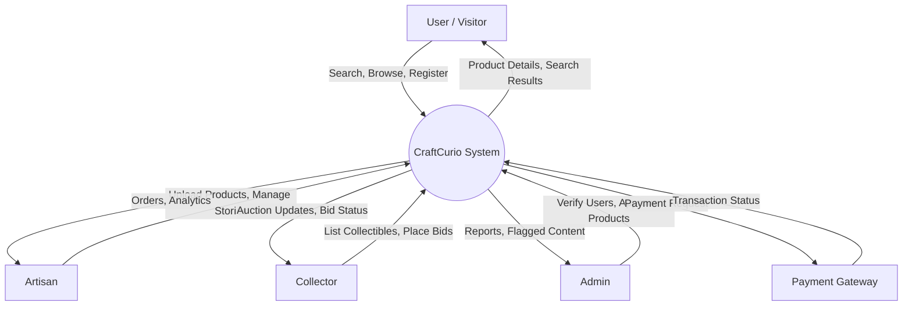
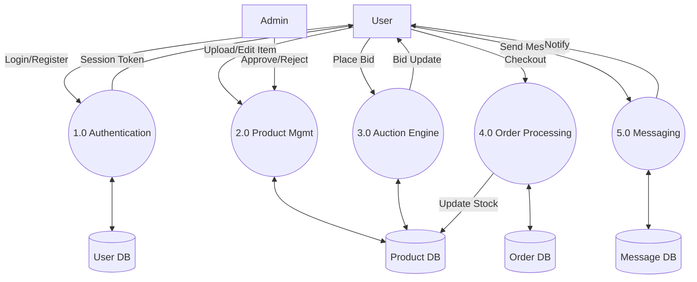
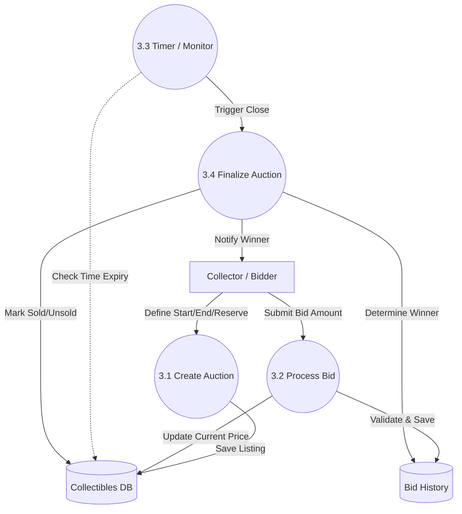
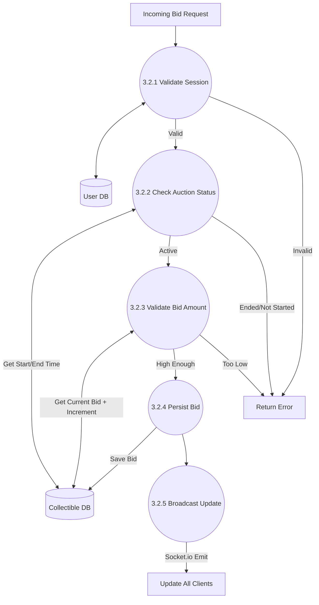
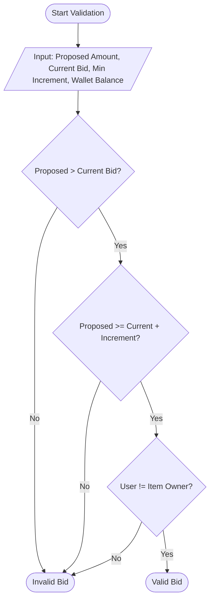

# CraftCurio Data Flow Diagrams (DFD)

This document contains Mermaid.js definitions for Data Flow Diagrams ranging from Level 0 (Context) to Level 4 (Detailed Logic).

## Level 0: Context Diagram
High-level view of the system and its interaction with external entities.

## Level 1: System Overview
Breakdown of the main system processes.

## Level 2: Auction Engine Breakdown
Detailed view of Process 3.0 (Auction Engine).

## Level 3: Process Bid Logic
Detailed view of Process 3.2 (Process Bid).

## Level 4: Validate Bid Amount Logic
Granular logic view of Process 3.2.3 (Validate Bid Amount).

