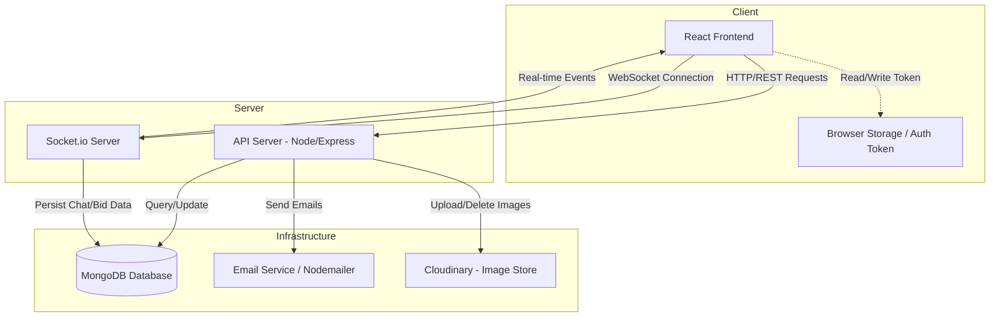
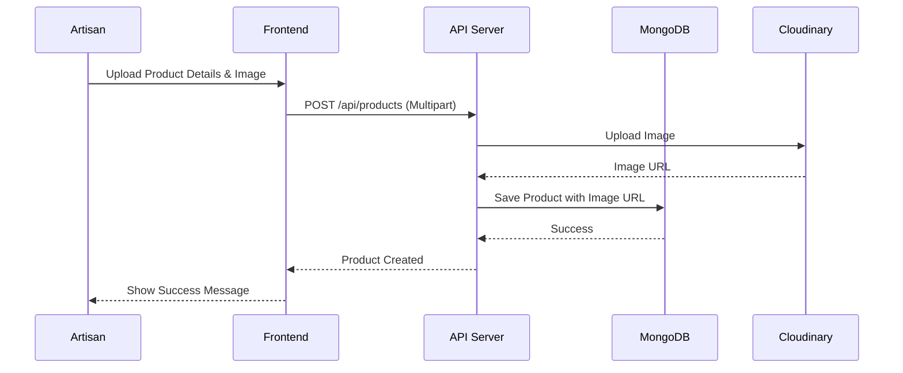

# CraftCurio: A Virtual Artisan & Collectibles Marketplace

**Student Name:** [Student Name]  
**Roll Number:** [Roll Number]  
**College:** [College Name]  
**Guide:** [Guide Name]  
**Department:** [Department Name]  
**Semester:** [Semester]  
**Academic Year:** [Year]

---

## Abstract

CraftCurio is a comprehensive full-stack web application designed to bridge the gap between artisans, collectors, and buyers. It serves as a specialized marketplace for authentic artisan crafts and rare collectibles, offering a unique hybrid sales model that includes both direct purchases and real-time auctions. The platform empowers artisans to tell their stories and connect directly with a global audience, while providing collectors with a dedicated space to manage and trade their valuable items.

The system is built using a modern MERN stack (MongoDB, Express.js, React, Node.js) and leverages Socket.io for real-time features such as live auction bidding and instant messaging. Key functionalities include role-based access control (Admin, Artisan, Collector, Buyer), a dynamic content management system for the "About Us" section, and an integrated email notification system. CraftCurio aims to foster a trusted community by ensuring transparency, authenticity, and seamless interaction among all users.

## 1. Introduction

### 1.1 Problem Statement
The traditional market for artisan crafts and collectibles is often fragmented and plagued by inefficiencies. Artisans struggle to reach a wider audience and share the stories behind their creations, often relying on middlemen who reduce their profit margins. Collectors face challenges in verifying authenticity and finding a centralized platform for trading rare items. Furthermore, existing general-purpose marketplaces lack the specialized features needed for auctions and community engagement that these niche markets require.

### 1.2 Objectives
The primary objectives of the CraftCurio system are:
*   To provide a dedicated platform for artisans to showcase and sell their products directly to buyers.
*   To create a robust marketplace for collectors to buy and sell rare items through direct sales or real-time auctions.
*   To facilitate real-time communication between users via a secure messaging system.
*   To enable administrators to manage platform content and user activities effectively.
*   To ensure a seamless and responsive user experience across different devices.

### 1.3 Scope and Target Users
The scope of the project includes the development of a web-based application with the following user roles:
*   **Buyers:** Can browse products, view artisan stories, and purchase items.
*   **Artisans:** Can list products, manage their profiles, and share their craft stories.
*   **Collectors:** Can list collectibles for sale or auction, place bids, and manage their collections.
*   **Admins:** Have full control over the platform, including user management, content updates (About Us, Mission, Vision), and system monitoring.

## 2. Existing System / Literature Survey

### 2.1 Existing Systems
Typical marketplaces for handmade goods (e.g., Etsy) or general auctions (e.g., eBay) exist, but they often operate in silos.
*   **General Marketplaces:** Lack the specific focus on "collectibles" and the auction mechanics often required for rare items. They may also not emphasize the "storytelling" aspect of artisan products.
*   **Auction Sites:** Often lack the community feel and the direct-sale option for non-auction items.
*   **Social Media:** Used by artisans for promotion but lacks integrated e-commerce and auction tools.

### 2.2 Limitations of Existing Systems
*   **Lack of Real-time Interaction:** Many platforms rely on static messaging or email, causing delays in negotiation and bidding.
*   **Weak Storytelling:** Standard product listings often fail to convey the cultural and personal significance of artisan crafts.
*   **Fragmented Experience:** Users often have to switch between different platforms for buying crafts and trading collectibles.

### 2.3 Proposed System (CraftCurio)
CraftCurio addresses these gaps by integrating:
*   **Hybrid Sales Model:** Seamlessly supporting both direct purchases (for artisan goods) and auctions (for collectibles).
*   **Real-time Features:** Live bidding updates and instant chat using Socket.io to create an engaging user experience.
*   **Dynamic CMS:** An admin-controlled "About Us" section that allows for dynamic storytelling and platform updates without code changes.
*   **Role-Specific Dashboards:** Tailored interfaces for Artisans and Collectors to manage their specific workflows efficiently.

## 3. System Requirements

### 3.1 Hardware Assumptions
*   **Client:** Any modern device (Laptop, Desktop, Tablet, Smartphone) with an internet connection.
*   **Server:** Cloud-based hosting (e.g., AWS, Heroku, Vercel) with support for Node.js and MongoDB.

### 3.2 Software Stack
*   **Frontend:** React (Vite), Tailwind CSS, Redux/Context API.
*   **Backend:** Node.js, Express.js.
*   **Database:** MongoDB (with Mongoose ODM).
*   **Real-time Communication:** Socket.io.
*   **Authentication:** JWT (JSON Web Tokens), Bcryptjs.
*   **Image Hosting:** Cloudinary.
*   **Email Service:** Nodemailer.
*   **Build Tools:** Vite, NPM.
*   **IDE:** VS Code / Antigravity.

## 4. System Architecture

The system follows a client-server architecture. The React frontend communicates with the Node.js/Express backend via RESTful APIs for standard operations and establishes a WebSocket connection via Socket.io for real-time events.



## 5. Module Design

### 5.1 User Authentication & Authorization
Handles user registration, login, and role management. Supports secure password authentication and OTP verification.

*   **Roles:** Buyer, Artisan, Collector, Admin.
*   **Key Components:** `AuthController`, `verifyToken` middleware.

### 5.2 Artisan Products & Stories
Allows artisans to list products and share their background stories.

*   **Features:** Product CRUD, Image Upload, Story Management.
*   **Diagram:**



### 5.3 Collectibles & Auctions
Manages the lifecycle of collectibles, including direct sales and real-time auctions.

*   **Features:** Create Listing, Place Bid, Buy Now, Auction Timer.
*   **Auction Flow:**

```mermaid
sequenceDiagram
  participant U as User
  participant FE as React Frontend
  participant WS as Socket.io Server
  participant API as Express API
  participant DB as MongoDB

  U->>FE: Place Bid (Amount)
  FE->>WS: emit("auction:placeBid", {amount, collectibleId})
  WS->>API: Validate Bid & Check Time
  API->>DB: Update Current Bid & History
  DB-->>API: Updated Document
*   **Pages:** `Landing.jsx`, `ProductDetails.jsx`, `CollectorDashboardPage.jsx`, `Chat.jsx`.
*   **Contexts:** `AuthContext` for user session, `CartContext` for shopping cart, `CollectorContext` for managing listings.
*   **Hooks:** Custom hooks like `useSocketAutoInit` in `socket.js` manage socket connections automatically.

**Real-time Integration:**
The `socket.js` utility exports functions like `joinAuction`, `onNewBid`, and `emitTyping` to abstract the socket logic from UI components, ensuring cleaner code.

## 8. User Interface & UX

*   **Design Language:** The application uses a modern, clean aesthetic with a focus on usability. Tailwind CSS provides a consistent color palette and responsive spacing.
*   **Navigation:** A persistent navigation bar allows easy access to key sections (Shop, Auctions, Dashboard, Profile).
*   **Responsiveness:** All pages are designed to be fully responsive, adapting layouts for mobile, tablet, and desktop screens.
*   **Accessibility:** Semantic HTML tags and ARIA labels are used where appropriate to enhance accessibility.

## 9. Testing

*   **Unit Testing:** Jest is configured for backend testing (e.g., testing utility functions).
*   **API Testing:** Postman/Insomnia used to verify REST endpoints.
*   **Manual Testing:** Extensive manual testing of user flows:
    *   **Scenario 1:** User registers as a Collector, lists an item for auction.
    *   **Scenario 2:** Another user places a bid; real-time update is verified.
    *   **Scenario 3:** Admin updates "Mission Statement"; change is reflected on About Us page.

## 10. Security & Performance

### 10.1 Security
*   **Authentication:** JWT for stateless authentication. Passwords hashed using Bcrypt.
*   **Authorization:** Middleware ensures only authorized roles can access specific routes (e.g., only Admins can edit About Us).
*   **Input Validation:** Zod schemas validate request data to prevent injection attacks and ensure data integrity.

### 10.2 Performance
*   **Database:** Mongoose indexes on frequently queried fields (e.g., `email`, `category`).
*   **Frontend:** React's virtual DOM and efficient state management minimize re-renders.
*   **Assets:** Images are optimized and served via Cloudinary CDN.

## 11. Results & Discussion

The implemented system successfully achieves the core objectives. The hybrid marketplace model works seamlessly, allowing users to buy artisan goods and bid on collectibles in real-time. The chat system facilitates smooth communication, and the admin dashboard provides necessary control over the platform's content. The use of Socket.io has proven effective for delivering low-latency updates for auctions and messaging.

## 12. Conclusion & Future Scope

### 12.1 Conclusion
CraftCurio presents a robust solution for the artisan and collectibles market. By combining e-commerce features with real-time interaction and storytelling, it creates a unique value proposition for its users.

### 12.2 Future Scope
*   **Mobile App:** Developing a React Native mobile application.
*   **AI Recommendations:** Implementing a recommendation engine for products.
*   **Payment Gateway:** Integrating Stripe/Razorpay for secure transactions.
*   **Analytics:** Advanced dashboard for sales and user engagement metrics.

## 13. References
*   React Documentation: https://react.dev/
*   Node.js Documentation: https://nodejs.org/en/docs/
*   Socket.io Documentation: https://socket.io/docs/v4/
*   MongoDB Manual: https://www.mongodb.com/docs/manual/
*   Tailwind CSS: https://tailwindcss.com/docs

---
